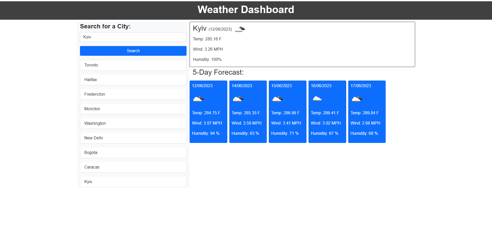
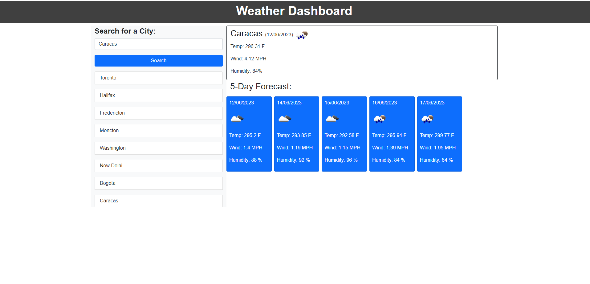

# Weather dashboard

## User Story
AS A traveler
I WANT to see the weather outlook for multiple cities
SO THAT I can plan a trip accordingly

## Description
 Weather dashboard starts with search for a city. User can see current weather conditions for that city.
 It presents with the city name, the date, an icon representation of weather conditions, the temperature, the humidity, and the the wind speed, And it presents with a 5-day forecast that displays the date, as well. User can change city and save it in local storage and click on a city in the search history. When user refresh the page сities steal populated in the page. 

## Gitpage reference
https://secretariuss.github.io/weather-dashboard/

## Screen shots

The following scrshots shows the web application's:

## Acceptance Criteria
GIVEN a weather dashboard with form inputs
WHEN I search for a city
THEN I am presented with current and future conditions for that city and that city is added to the search history
WHEN I view current weather conditions for that city
THEN I am presented with the city name, the date, an icon representation of weather conditions, the temperature, the humidity, and the the wind speed
WHEN I view future weather conditions for that city
THEN I am presented with a 5-day forecast that displays the date, an icon representation of weather conditions, the temperature, the wind speed, and the humidity
WHEN I click on a city in the search history
THEN I am again presented with current and future conditions for that city
